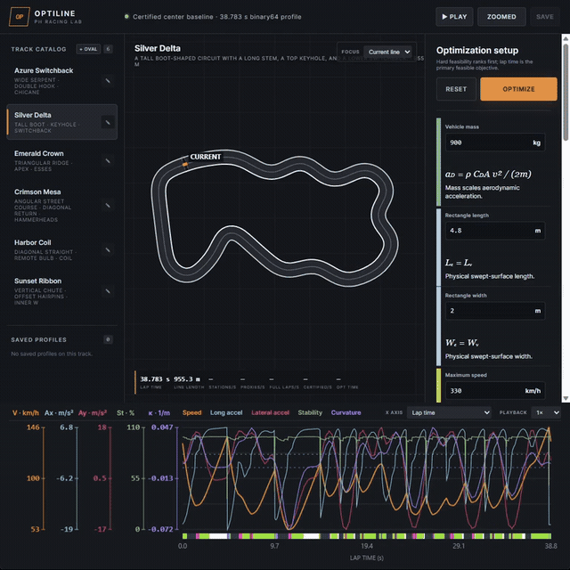

# Optiline

<https://ahrvoje.github.io/optiline/>

  

Optiline is a browser-based laboratory for finding closed, minimum-lap-time racing trajectories inside exact Pythagorean-hodograph (PH) track boundaries. WebGPU searches large candidate populations, a binary64 CPU path validates finalists, and the shared C99/WebAssembly kernel supplies authoritative PH compilation and compatibility checks.

## Mathematical model

### Track representation

Each source track is a cyclic sequence of 64 centerline gates. The compiler interpolates them with a closed quintic PH B-spline. In complex form, a quadratic spline preimage $w(t)$ defines the centerline $\zeta(t)$ through

$$
w(t)=\sum_j c_jN_{j,2}(t),
\qquad
\zeta'(t)=w(t)^2.
$$

The PH identity makes speed and arc length polynomial:

$$
\sigma(t)=|\zeta'(t)|=|w(t)|^2,
\qquad
S(t)=\int_0^t\sigma(\xi)\,d\xi.
$$

With the unit normal $\mathbf n_c(s)$, the authoritative lane boundaries are rational PH offsets

$$
\mathbf b_L(s)=\mathbf c(s)+d_L\mathbf n_c(s),
\qquad
\mathbf b_R(s)=\mathbf c(s)-d_R\mathbf n_c(s).
$$

The compiler rejects singular, self-intersecting, or mutually intersecting offsets. Candidate feasibility is based on the swept vehicle rectangle inside this lane, not only on the path of the vehicle center.

### Trajectory representation

Optimization uses a smooth periodic chart fitted to the PH centerline. With normalized PH arc length $u=s/L_{\mathrm{PH}}$,

$$
\mathbf c_K(u)=\mathbf a_0+
\sum_{k=1}^{K_K}
\left[\mathbf a_k\cos(2\pi ku)+\mathbf b_k\sin(2\pi ku)\right],
$$

$$
\Phi(u,d)=\mathbf c_K(u)+d\,\mathbf n_K(u).
$$

The discovery trajectory is $\mathbf r(u)=\Phi(u,d(u))$. Its latent lateral field separates global and local scales:

$$
z(u)=F(u)\mathbf a+\left(B(u)-F(u)G\right)\mathbf b,
$$

$$
G=(F^{\mathsf T}WF)^{-1}F^{\mathsf T}WB.
$$

Here, $F$ is a real Fourier basis and $B$ is a periodic quintic B-spline basis. The projection $B-FG$ removes the low-frequency Fourier component from the local residual. A bounded decoder maps every finite coefficient vector into the robust rectangle-safe corridor:

$$
d(u)=m(u)+h(u)\tanh z(u).
$$

Periodicity gives structural position closure. The quintic residual makes the discovery curve $C^4$, while analytic first and second derivatives provide

$$
\kappa(u)=
\frac{\mathrm{cross}(\mathbf r'(u),\mathbf r''(u))}
{\|\mathbf r'(u)\|^3}.
$$

The finalist is converted to intrinsic curvature coordinates. For normalized trajectory arc length $\tau=\ell/L$, define dimensionless curvature $K(\tau)=L\kappa(\ell)$ and represent

$$
K(\tau)=K_*(\tau)+\delta K_F(\tau)+\delta K_B(\tau)
+\sum_{j=0}^{2}\lambda_j\phi_j(\tau).
$$

The three reserved modes are solved by a damped Newton projection so that total turn and position close simultaneously:

$$
\int_0^1K(\tau)\,d\tau=2\pi\nu,
\qquad
\int_0^1\cos\theta(\tau)\,d\tau=0,
\qquad
\int_0^1\sin\theta(\tau)\,d\tau=0,
$$

where $\theta(\tau)=\theta_0+\int_0^\tau K(\xi)\,d\xi$ and $\nu\in\{-1,1\}$. The physical curve follows by integration, scaling, rotation, and translation:

$$
\mathbf r(\tau)=\mathbf t+R(\varphi)L
\int_0^\tau
\begin{bmatrix}\cos\theta(\xi)\\\sin\theta(\xi)\end{bmatrix}d\xi.
$$

### Vehicle and lap-time model

The quasi-steady model combines aerodynamic drag, downforce-scaled tire capacity, and a longitudinal/lateral acceleration superellipse. With $q=v^2$,

$$
a_D(v)=\frac{\rho C_DA}{2m}v^2,
\qquad
\chi(v)=1+\frac{\rho C_LA}{2mg}v^2,
\qquad
a_y=q\kappa.
$$

For a fixed path, spatial dynamics reduce to

$$
\frac{dq}{d\ell}=2a_t.
$$

The solver starts from the pointwise lateral and maximum-speed caps, then applies periodic implicit-midpoint forward traction and backward braking operators until it reaches a fixed point. The discrete lap time is

$$
T=\sum_i
\frac{2\Delta\ell_i}{\sqrt{q_i}+\sqrt{q_{i+1}}}.
$$

## Optimizer

The optimizer uses a feasibility-first, multi-fidelity search:

1. Track preprocessing validates PH geometry, constructs the Fourier chart, and derives a conservative rectangle-safe corridor.
2. Eight WebGPU islands generate 1,024 candidates each, for 8,192 candidates per generation. Antithetic, frequency-separated mutations scale approximately as $k^{-2}$, because equal-amplitude high-frequency displacement changes curvature quadratically faster.
3. Station/candidate WGSL kernels decode geometry, measure constraint violation, run eight cyclic speed-envelope sweeps, and return proxy lap time, regularity, and clearance.
4. The complete GPU population updates each island. A small rotating set of elites is reranked by the binary64 full evaluator so proxy values and truth values are never compared directly.
5. Spectral continuation adds Fourier modes before exact periodic knot insertion activates progressively finer local residuals. Smooth symmetric pattern probes and bounded quadratic combinations refine late-stage solutions.
6. The best discovery elite is converted to intrinsic curvature, closure-projected, reconstructed, and evaluated on successively finer meshes.
7. The certifier worker checks closure, regularity, dynamics, continuous rectangle motion, and convergence at 2,048, 4,096, and 8,192 profile edges. Only a passing finalist can replace the displayed certified trajectory.

Candidates are ordered lexicographically rather than by a weighted penalty:

$$
\left(
I_{\mathrm{infeasible}},
\|\mathbf v_{\mathrm{constraint}}\|_\infty,
T,
R_\kappa,
-c_{\min}
\right).
$$

This makes hard feasibility dominant, followed by lap time, curvature quality, and minimum clearance.

## Implementation

| Component | Implementation |
| --- | --- |
| Interface and visualization | Native HTML/CSS, TypeScript, Canvas 2D, WebGPU |
| Population search | Web Worker with WGSL compute kernels |
| Reference mathematics | ISO C99 compiled with MSVC and WASI SDK |
| Final curvature validation | Binary64 certifier worker with nested-mesh checks |
| Persistence | IndexedDB profiles, tracks, and optimizer checkpoint records |
| Deployment | Static Vite build with relative URLs for GitHub Pages |

The application has no server-side component and no account system.

## References

1. R. T. Farouki, *Pythagorean-Hodograph Curves: Algebra and Geometry Inseparable*, Geometry and Computing, vol. 1, Springer, 2008. [doi:10.1007/978-3-540-73398-0](https://doi.org/10.1007/978-3-540-73398-0)
2. C. T. Zahn and R. Z. Roskies, “Fourier Descriptors for Plane Closed Curves,” *IEEE Transactions on Computers*, vol. C-21, no. 3, pp. 269–281, 1972. [doi:10.1109/TC.1972.5008949](https://doi.org/10.1109/TC.1972.5008949)
3. M. Saba, T. Schneider, K. Hormann, and R. Scateni, “Curvature-Based Blending of Closed Planar Curves,” *Graphical Models*, vol. 76, no. 5, pp. 263–272, 2014. [doi:10.1016/j.gmod.2014.04.005](https://doi.org/10.1016/j.gmod.2014.04.005)
4. H. Xue, T. Yue, and J. M. Dolan, “Spline-Based Minimum-Curvature Trajectory Optimization for Autonomous Racing,” *arXiv:2309.09186*, 2023. [arXiv:2309.09186](https://arxiv.org/abs/2309.09186)
5. N. R. Kapania, J. K. Subosits, and J. C. Gerdes, “A Sequential Two-Step Algorithm for Fast Generation of Vehicle Racing Trajectories,” *Journal of Dynamic Systems, Measurement, and Control*, vol. 138, no. 9, article 091005, 2016. [doi:10.1115/1.4033311](https://doi.org/10.1115/1.4033311)
6. H. Pham and Q.-C. Pham, “A New Approach to Time-Optimal Path Parameterization Based on Reachability Analysis,” *IEEE Transactions on Robotics*, vol. 34, no. 3, pp. 645–659, 2018. [doi:10.1109/TRO.2018.2819195](https://doi.org/10.1109/TRO.2018.2819195)
7. M. Massaro and D. J. N. Limebeer, “Minimum-Lap-Time Optimisation and Simulation,” *Vehicle System Dynamics*, vol. 59, no. 7, pp. 1069–1113, 2021. [doi:10.1080/00423114.2021.1910718](https://doi.org/10.1080/00423114.2021.1910718)
